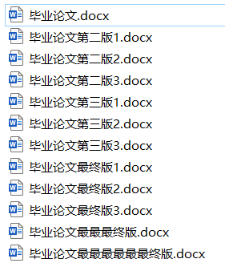

毕业写论文的时候发现一件事情，写完第一版发给老师，老师点评完拿回来修修改改，又发给老师，又改一版，到最后我的毕业论文目录变成了这样子：

无法忍受！😣

所以，我们需要一个版本控制工具。

---

## 毕业论文如何做版本控制
## 四个工作区概念的理解
**工作目录（Working Directory）**

当前实际编辑文件写代码的区域，所有修改都直接发生在这里，但 Git 尚未记录这些变化。
比如说你在 Word 中添加了新章节、修改了图表，此时论文处于未保存状态。

**暂存区（Stage）**

论文提交前的 "草稿箱" 或 "待审核区"。
你可以精心挑选本次要提交的部分（如只提交第一章的修改，忽略第二章）。

**本地仓库（Local Repository）**

你将 "待审核区" 的内容正式保存到电脑硬盘，Git会记录每次提交形成一个可追溯的版本。

**远程仓库（Remote Repository）**

学校的论文提交系统或共享云盘，供导师下载和评审查看的地方。

## 交互流程（提交与更新）

**场景 1：你完成了论文修改并提交**

修改文件（工作目录）：你在 Word 中修改了论文的第一章和参考文献。

添加到暂存区（git add）：只选择第一章的修改加入暂存区，参考文献下次再提交。

提交到本地仓库（git commit）：将暂存区的内容永久保存到本地硬盘。

推送到远程仓库（git push）：将本地的新版本上传到学校系统，供导师查看。

**场景 2：导师反馈后你更新论文**

拉取远程更新（git pull）：从学校系统下载导师的批注和修改建议。

在本地修改（工作目录）：根据反馈修改论文，并新增致谢部分。

重复提交流程：将修改后的内容依次添加到暂存区、提交到本地仓库，最后推送到远程仓库。

---

## Git命令类比

| 毕业论文操作       | Git 命令             | 作用                           |
| ------------------ | -------------------- | ------------------------------ |
| 在 Word 中编辑论文 | 直接修改文件         | 在工作目录中编辑文件           |
| 保存到草稿箱       | git add file       | 将文件修改添加到暂存区         |
| 保存为正式版本     | git commit -m "..."  | 将暂存区内容提交到本地仓库     |
| 上传到学校系统     | git push origin main | 将本地仓库推送到远程仓库       |
| 下载导师修改       | git pull origin main | 从远程仓库拉取更新并合并到本地 |
| 查看历史版本       | git log              | 查看本地仓库的提交历史         |

