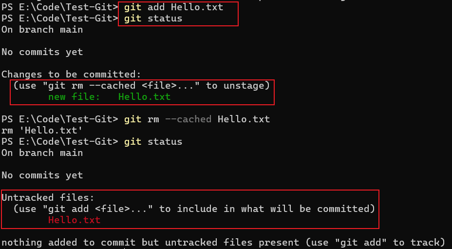
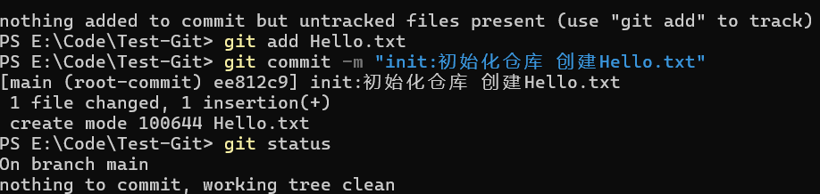
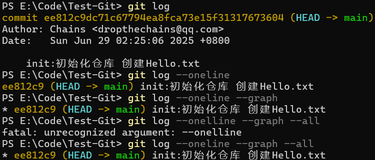
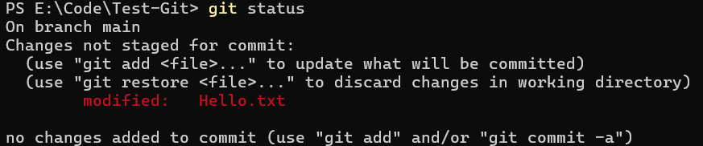
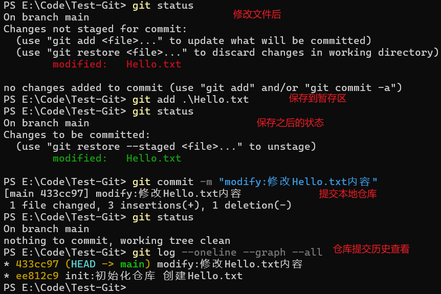
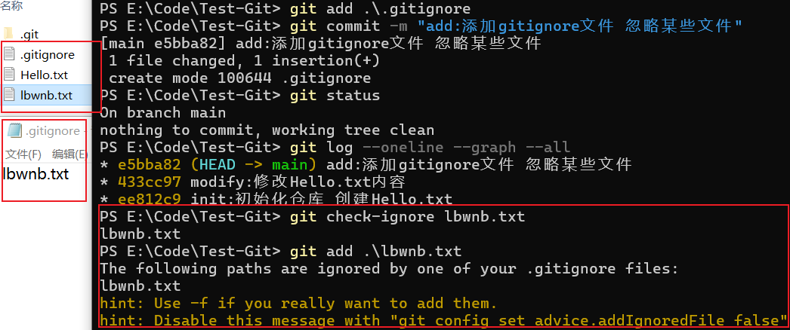
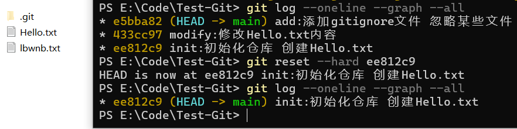
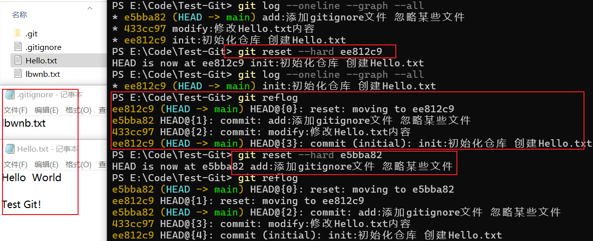

### 初始化
创建一个Test-Git文件夹，在此文件夹打开cmd

```bash
git init 
```

初始化之后会有一个隐藏文件夹 `.git` 

使用 `git status` 查看这个本地仓库的情况

```bash
git status

output

PS E:\Code\Test-Git> git status
On branch main

No commits yet

nothing to commit (create/copy files and use "git add" to track)
```

他的输出内容就是说在这个main分支下 没有任何提交记录 希望你创建一个文件并且使用git add 命令来追踪
### 添加文件、暂存文件、撤销暂存、提交本地仓库

创建一个Hello.txt的文件，再使用 `git status` 命令看下状态


Untracked files就是未被追踪的文件，按照提示再使用 `git add Hello.txt` 



```bash
git add Hello.txt
git rm --cached Hello.txt
```

add之后文件就被提交到暂存区，想撤销暂存，按照提示还可以使用 `git rm --cached Hello.txt` 发现文件又回到了没有add之前的状态，ok啊，重新提交一下，试试commit。





```bash
git commit -m "填写提交备注"
git commit -m "init:初始化仓库 创建Hello.txt"
```

commit之后意味着：Hello.txt文件就从暂存区提交到了本地仓库中。

### 查看提交历史

使用 `git log`命令可以查看提交历史
```bash
// 查看提交历史
git log  
// 简略查看提交历史 多行内容省略为一行
git log --oneline 
// 简略查看、带图形查看（此处只有一个分支）
git log --oneline --graph
// 简略查看、带图形查看、所有分支
git log --oneline --graph --all
```




### 修改文件、暂存、提交本地仓库

再次打开Hello.txt  修改文件内容 保存。之后再次使用 `git status` 来查看状态。



发现多了一条提示的命令git restore file：意思是放弃工作目录中的更改。来试一下，再次打开Hello.txt 发现刚刚添加的内容没了？没错，就是这个效果。

现在重新执行修改文件、提交暂存区、提交本地仓库的、查看状态的流程。



### git show 查看提交仓库的改动

使用 `git show` 可以查看仓库中每次commit中的详细变更信息，如下图：


下面来解释一下这些每一行的输出信息到底意味着什么？

#### 提交基本信息：
- commit 后是 提交哈希值（唯一标识这次提交），(HEAD -> main) 表示当前 HEAD 指针指向 main 分支，即当前工作在 main 分支。
- Author 和 Date 是提交者信息、提交时间。
- 最后一行是 提交说明（commit message），描述这次提交做了什么：修改 Hello.txt 文件内容。

#### 文件变更对比（diff）：
- 这部分是 文件内容的差异对比，展示 Hello.txt 从旧版本（a/Hello.txt）到新版本（b/Hello.txt）的变化：
- --- a/Hello.txt 代表旧版本文件，+++ b/Hello.txt 代表新版本文件。
- @@ -1 +1,3 @@ 是 Git 的 范围标记，表示对比的行范围：旧版本从第 1 行开始，新版本从第 1 行开始且新增了内容（最终共 3 行相关变更）。
- -Hello World 表示旧版本中删除的内容（- 开头是删除行）。
- +Hello World、+、+Test Git! 是新版本中新增的内容（+ 开头是新增行）。
- \ No newline at end of file 说明旧版本文件末尾没有换行符，新版本中因新增内容，换行符情况也变化了。


### ignore 忽略不想提交到仓库的文件

在项目根目录下创建一个lbwnb.txt 和 `.gitignore` 文件，在ignore文件中添加一条规则为：lbwnb.txt,这样就可以在提交到仓库时保证它被忽略。



从图上可以看出来，在执行 `git check-ignore lbwnb.txt` 和 `git add 忽略文件名`时，lbwnb这个文件已经被忽略，如果想要add添加到暂存区？不好意思喔😄。

### 回滚

如果想要回到过去的版本，可以执行回滚操作，执行后，可以将工作空间中的内容恢复到指定提交的版本号的状态。

```bash
git reset --hard commitID
```

执行后，会直接重置到那个版本时候的状态，再次查看提交日志，会发现之后的日志全部消失了。



从图上可以看到，回滚之前的日志和回滚之后的日志的变化，文件夹中ignore文件也消失了，Hello文件中修改的内容也消失了！😯 为什么lbwnb还在，因为他之前被忽略提交了喔。

但是又想要回到之前已经写好的状态呀？可是找不到之前的commitID了，怎么办？

```bash
git reflog
```

用这个命令可以显示所有分支所有操作记录，能帮你找回丢失提交、恢复误删分支，堪称 “代码后悔药”😭。
reflog记录了分支指针、HEAD 的移动轨迹（比如提交、合并、重置、切换分支等操作），即使提交被删、分支误删，只要在保留期内（默认 90 天 ），都能通过它找回。

- `HEAD@{n}`：n 是操作序号（0 最新、1 上一次，以此类推 ），记录了 HEAD 位置变化。
- 每行对应一次操作（提交、切换、回退等 ），能看到操作类型、提交哈希、简要描述。




